# School District Analysis


## Overview of the school district analysis
The School District Analysis project was designed to uncover trends and patterns in the district's data to provide important information such as top performing schools, math and reading passing percentages by school, spending ranges per student, among others. These key-metrics can be used to make important decisions by the school board and the superintendent. This analysis will help the district make informed decisions  regarding their budgets and efforts within their schools.
 
The first report that we needed to create was a school district summary including the following key-metrics. 

- Total number of students
- Total number of schools
- Total budget
- Average math score
- Average reading score
- Percentage of students who passed math
- Percentage of students who passed reading
- Overall passing percentage

The following image shows the total schools, their budget, average scores and percentages, and the district's students overall passing percentage.

### **District summary**

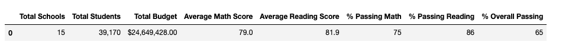

The school board wanted to look at the breakdown by school of the above summary to see trends and patterns.

### **Per school summary**

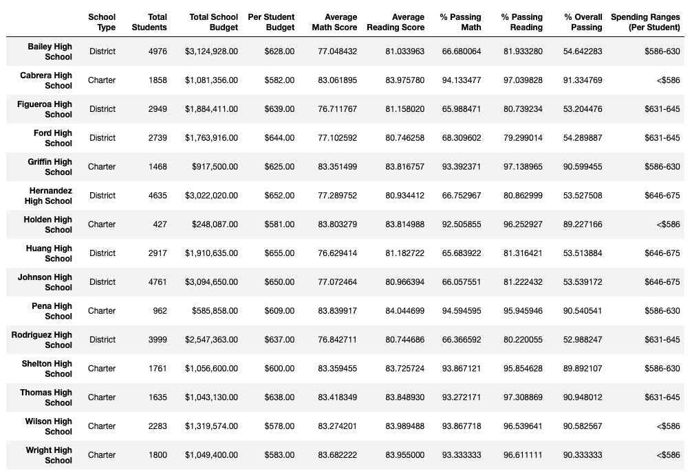

Additionally, the board asked for the following data:  both top and bottom five performing schools based on overall passing percentage; math and reading scores by grade; school performance based on budget per student, school size and type of school. This data is shown in the tables below. 

### **Top five schools**

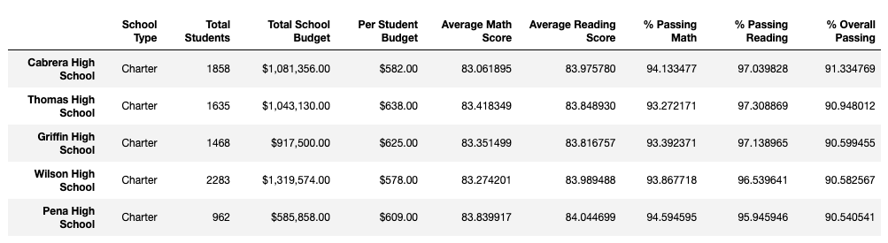

### **Top bottom schools** 

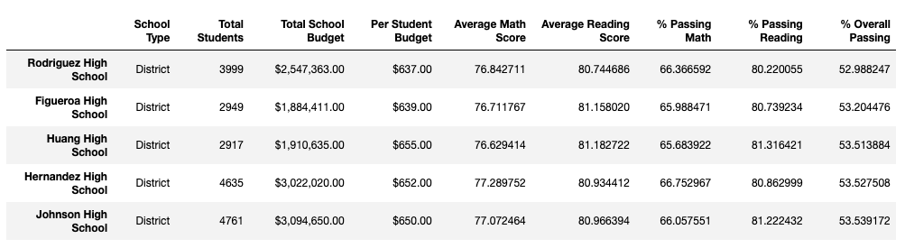

### **Math scores by grade**

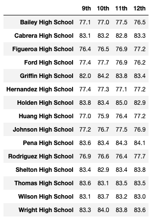

### **Reading scores by grade**

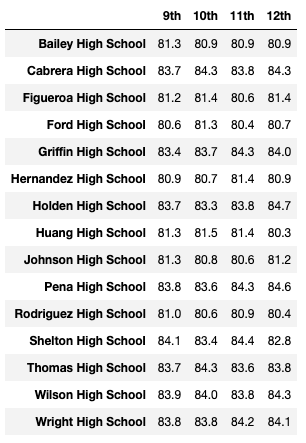

### **Performance based on the budget per student**

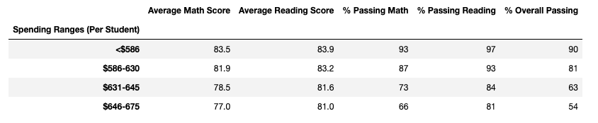

### **Performance based on the school size**

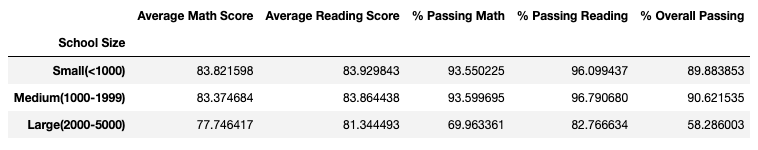

### **Performance based on the type of school**

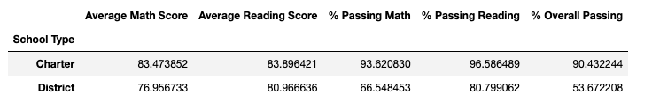


# Challenge

The school board noticed evidence of academic dishonesty at Thomas High School. Grades for reading and math in ninth-grade may had been tampered with. The school board asked to remove these grades from the data and re-run the analysis. To do this, I replaced all the ninth grade scores with NaNs and kept the rest of the data unaltered. 

After removing both math and reading scores for ninth-grade students from Thomas High School, the passing math percentage dropped by only 2 tenths of a point, while the overall passing percentage dropped a mere 1 tenth of a point. From a district perspective, this difference may be negligible; however, it's worth looking more into these changes and its impact.

The following table shows a portion of the data where we can observe that scores in ninth-grade have been replaced with NaNs. 

### **NaN 9th graders**

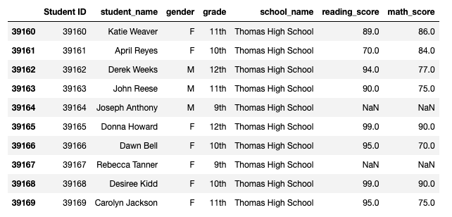

### **Revised district summary**

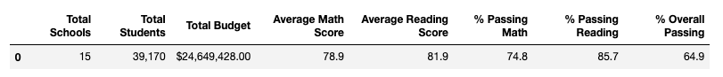

### **Revised per school summary**


### **Revised per school summary Thomas High school**

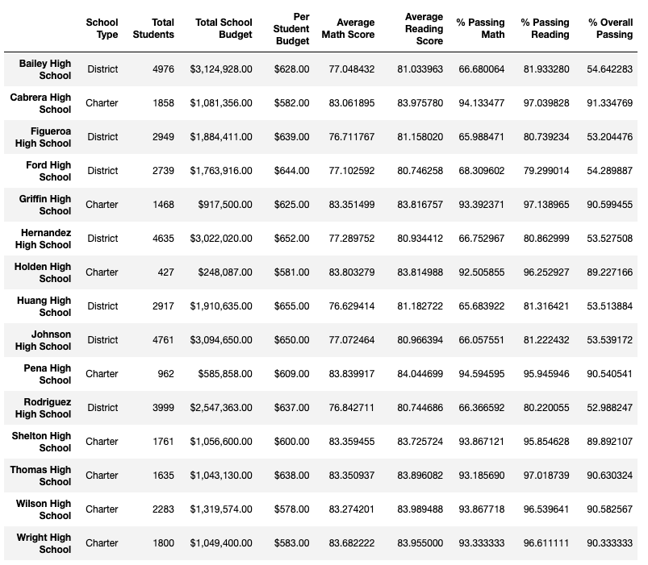

### **Revised top five schools**

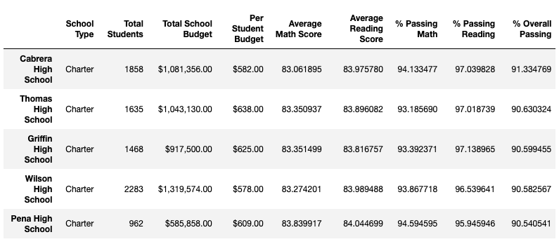

### **Revised top bottom schools**

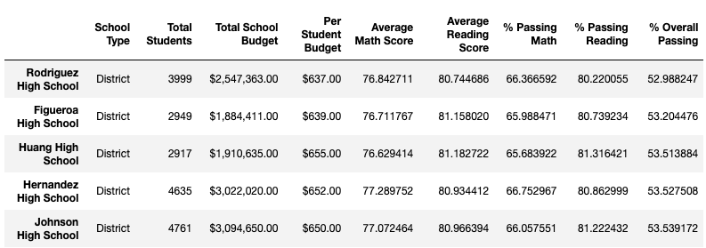

### **Revised math scores by grade**

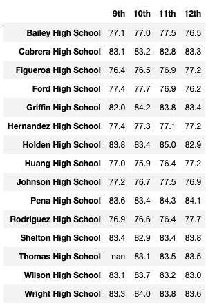

### **Revised reading scores by grade**

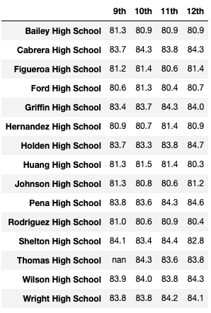

### **Revised school performance based on the budget per student**

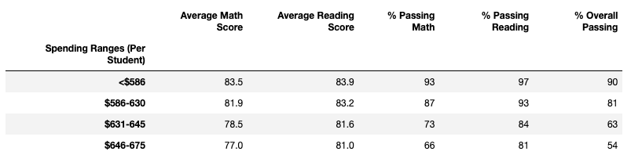

### **Revised school performance based on the school size**

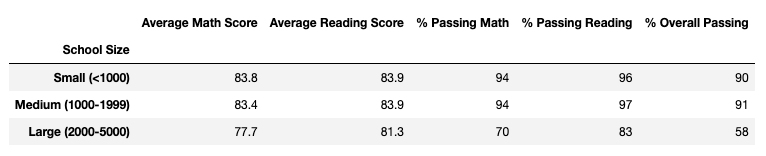

### **Revised school performance based on the type of school**


Although the average scores barely changed after removing ninth-grade scores, the drop in percentage of reading, math, and overall passing percentage was significant in Thomas High School. Other schools were unaffected, as these changes were localized at Thomas High School and only for ninth-grade; however, we see a substantial change in this particular school performance when compared to other schools.

Thus, by replacing the ninth-grade scores with NaNs the scores were affected as shown below.

- Math scores in Thomas High School (THS) dropped 26.3609 percentage points 
- Reading scores in THS dropped 30.6453 percentage  points
- Overall scores in THS dropped 25.8715 percentage  points

## Replacing the ninth-grade scores
After closely inspecting the data, replacing ninth-grade scores  had some impact in the data, especially when looking at scores by grade where we can see NaNs in ninth-grade. And when looking at the revised school summary where we see a drop in THS percentages.
```
Passing Math percentage: 66.9113
Passing Reading percentage: 66.6636
Overall passing percentage: 65.0765
```

However, when considering only 10th, 11th and 12th grade in our analysis, the delta was of only 0.0865, 0.2902, and 0.3177 percentage points in math, reading, and overall scores respectively. Our new percentages show only a small difference compared to the original per school summary. 
```
Passing Math percentage: 93.1857
Passing Reading percentage: 97.0187
Overall passing percentage: 90.63.03
```
These differences had ultimately no bearing on the following data.
 
- Scores by school spending
- Scores by school size
- Scores by school type

In conclusion, for this particular study it was better to remove the suspect data than to work with NaNs, as it resulted in significant changes in score percentages, and it would have greatly affected the rest of the analysis.

