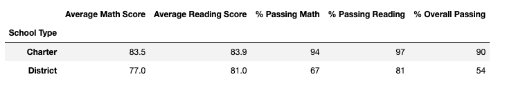

# School District Analysis

## Overview of the school district analysis
The School District Analysis project was designed to uncover trends and patterns in the district's data to provide important information such as top performing schools, math and reading passing percentages by school, spending ranges per student, among others. These key-metrics can be used to make important decisions by the school board and the superintendent. This analysis will help the district to make informed decisions  regarding their budgets and efforts within their schools.
 
The first report that we needed to create was a school district summary including the following key-metrics. 

- Total number of students
- Total number of schools
- Total budget
- Average math score
- Average reading score
- Percentage of students who passed math
- Percentage of students who passed reading
- Overall passing percentage

The following image shows the total schools, their budget, average scores and percentage and the district's students overall passing percentage.

The school board wanted to look at the breakdown by school of the above summary to see trends and patterns for particular schools.

Top five schools 

5 less perfoming schools 

**math scores by grade**

**reading scores by grade**

**School performance based on the budget per student**

**School performance based on the school size**

**School performance based on the type of school**

# Challenge

**district summary challenge**

**per school summary challenge**

**NaN 9th graders**

**per school summary Thomas High school**

**Top five schools challenge challenge**

5 less perfoming schools 

**challenge math scores by grade**

**challenge reading scores by grade**

**School performance based on the budget per student challenge**

**School performance based on the school size challenge **

**School performance based on the type of school challenge**

## *Results: Using bulleted lists and images of DataFrames as support, address the following questions.*

### How is the district summary affected?

### How is the school summary affected?

### How does replacing the ninth graders’ math and reading scores affect Thomas High School’s performance relative to the other schools?
### How does replacing the ninth-grade scores affect the following:
- Math and reading scores by grade
- Scores by school spending
- Scores by school size
- Scores by school type
## Summary: Summarize four changes in the updated school district analysis after reading and math scores for the ninth grade at Thomas High School have been replaced with NaNs.

Here is the list of deliverables for the analysis of the school district: 

A high-level snapshot of the district's key metrics, presented in a table format
An overview of the key metrics for each school, presented in a table format
Tables presenting each of the following metrics:
Top 5 and bottom 5 performing schools, based on the overall passing rate
The average math score received by students in each grade level at each school
The average reading score received by students in each grade level at each school
School performance based on the budget per student
School performance based on the school size 
School performance based on the type of school
Before we can begin these tasks, we need to import the datasets into Jupyter Notebook using Python.